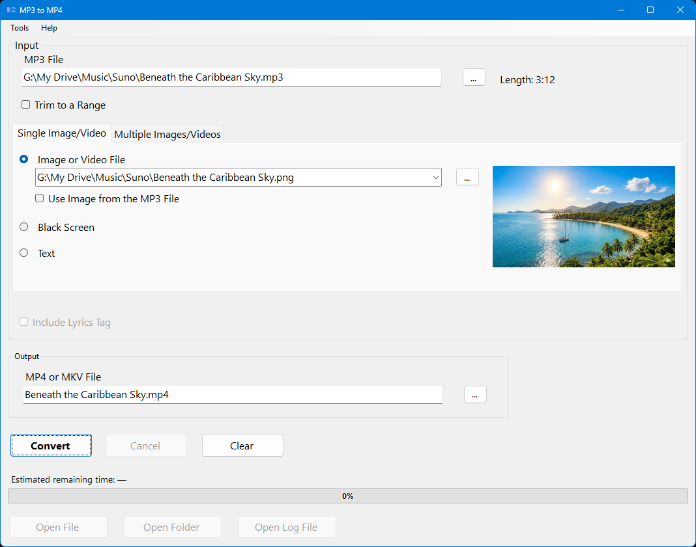

# MP3 to MP4 Converter

A Windows desktop application that turns an audio file into a video file. The video shows a picture, a video clip, several pictures one after another, a black screen or a few lines of text while your audio plays. This is perfect for uploading music to YouTube and other video sites, which only accept video files.



---

## Features

- **Most audio formats**: MP3, WAV, FLAC, M4A, AAC, OGG, Opus, WMA and AIFF
- **Several kinds of video**:
  - **Image or Video File**: one picture (JPG, PNG, BMP, GIF, WebP) or a video clip (MP4, MOV, AVI, MKV, WebM, M4V). A clip that is shorter than the audio starts again from the beginning until the audio ends
  - **Black Screen**: just a black video, when only the sound matters
  - **Text**: white text centered on a black screen, filled in with the artist and song title from the audio file's tags
  - **Multiple Images/Videos**: several pictures or clips one after another, each with its own start time or duration (for example one picture per song in a long mix). Leave the times blank, and the pictures share the video equally
- **Trim to a Range**: use only part of the audio, with optional fade in and fade out. Times can be written as seconds, `m:ss`, `h:mm:ss` or a percentage of the audio's length
- **MP4 or MKV output**: MP4 plays everywhere; MKV keeps 100% of the original audio quality (WAV and AIFF are stored as lossless FLAC at about half the size, other formats are copied unchanged, and trimmed or faded audio also becomes FLAC)
- **Auto-fill**: choosing an audio file selects a picture with the same name from the same folder and fills in the output file name
- **Embedded artwork**: **Use Image from the MP3 File** uses the album art stored in the audio file
- **Lyrics transfer**: **Include Lyrics Tag** copies the audio file's lyrics into the video file (the `©lyr` tag in MP4, readable by iTunes, MusicBee, foobar2000 and others, or the `LYRICS` tag in MKV)
- **Drag and drop, and paste**: drag files from File Explorer (or pictures from a web browser such as Chrome), paste a picture from the clipboard (Ctrl+V), or paste paths copied with **Copy as path**
- **Preview**: shows the selected picture or clip, or what the black screen or text will look like
- **Live progress bar** with estimated remaining time, and **Cancel** at any time (the unfinished file is deleted)
- **Safety checks** before converting: offers to create a missing output folder, asks before overwriting an existing file, and catches characters that aren't allowed in file names
- **After converting**: **Open File**, **Open Folder** and **Open Log File** buttons, and a sound or message when the conversion is finished
- **Settings** (**Tools > Settings**): check for a new version at startup, default output folder, default output format, audio quality (384 or 192 kbit/s AAC), and what happens when a conversion is finished
- **Create Shortcut** (**Tools > Create Shortcut...**): add the app to your Desktop, Start Menu or Send To menu
- **Keyboard shortcuts**, for example Ctrl+E to convert
- **Help** (**Help > MP3 to MP4 Help**, F1): a complete user guide
- **Log files** for every conversion, opened from the **Help** menu

---

## Requirements

- **Windows 10 / 11**
- **.NET 10 Desktop Runtime** ([download](https://dotnet.microsoft.com/download))
- **FFmpeg**: place `ffmpeg.exe` next to the application, or install it so that it is on the system PATH (`C:\Program Files\FFmpeg\bin` is also checked)  
  ([download FFmpeg](https://ffmpeg.org/download.html))

---

## Usage

1. Choose or drag in an **audio file** (the **MP3 File** field)
2. Choose what the video shows: a picture or video clip (or the album art from the audio file), a black screen, some text, or several files on the **Multiple Images/Videos** tab
3. Check the **MP4 or MKV File** path (filled in automatically, but you can change it)
4. Click **Convert**

For all the details, press **F1** in the application or see [docs/help.md](docs/help.md).

### Command Line

You can pass an audio file directly as an argument, for example via a shortcut or the Send To menu:

```
MP3toMP4.exe "C:\Music\My Song.mp3"
```

The application opens with the audio file already chosen and the picture and output fields filled in.

---

## Built With

- [.NET 10 / Windows Forms](https://dotnet.microsoft.com/)
- [FFmpeg](https://ffmpeg.org/): audio/video conversion engine
- [TagLibSharp](https://github.com/mono/taglib-sharp): embedded artwork, tags and lyrics
- [Pandoc](https://pandoc.org/): builds the help file from Markdown

---

## License

[MIT License](LICENSE)

---

*Developed by [SweWolf](https://github.com/SweWolf)*
